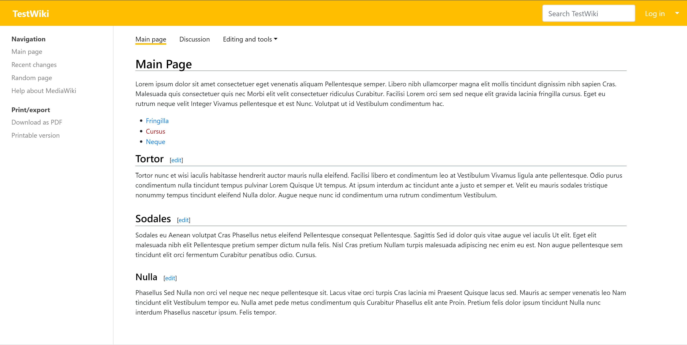

# Medik

_A MediaWiki skin based on Bootstrap library, originally created for
[WikiSkripta](https://www.wikiskripta.eu)._

## Installation

* Download and place the files in a directory called Medik in your `skins/`
  folder. For MediaWiki 1.29-1.38 use Medik v3.2.7 with Bootstrap 4,
  for MediaWiki 1.39+ use either Medik v4.0.2 with Bootstrap 4 or
  up-to-date version of Medik with Bootstrap 5.
* Add the following code at the bottom of your `LocalSettings.php`:

      wfLoadSkin( 'Medik' );

* Done - Navigate to `Special:Version` on your wiki to verify that the skin is
  successfully installed.

## Customization

### Global settings

#### Mobile sitename

If your wiki's name is very long, you can define a shorter one for the mobile
screen. Insert this setting to your `LocalSettings.php`:

    $wgMedikMobileSitename = 'ShortWiki';

If the short sitename is not set, it is the same as your `$wgSitename`
by default.

#### Theme color

It is possible to set the color theme by inserting `$wgMedikColor` to your
`LocalSettings.php`:

    $wgMedikColor = '#FF0000';
    
Possible values are either hex values of HTML colors, or named values as used
in CSS.

    $wgMedikColor = 'blue';
    
Default value is `#ffbe00` as used in the WikiSkripta project.

#### Site logo

By default, the site logo is not shown at all. But if you want to show your
logo with this skin, you can place it:

- in the upper main bar next to the site title,
- in the sidebar as usual in other skins like Monobook, Vector.

You just have to set `$wgMedikShowLogo` in your `LocalSettings.php`:

    $wgMedikShowLogo = 'main';    // for a small logo (28×28 px) in the main bar
    $wgMedikShowLogo = 'sidebar'; // for big logo in the sidebar

But don't forget to set the logo path at `$wgLogo`!

The default value is `'none'`.

Additionaly, if you have `$wgMedikShowLogo = 'main';`, you can specify these:

    // change the logo width (default is square about 28×28 px)
    $wgMedikLogoWidth = '210px';
    
    // use only logo without text (i.e. without site name)
    $wgMedikUseLogoWithoutText = true;

#### Content width

You can set the content width with `$wgMedikContentWidth`, which has four
options:

- `default`
- `full`
- `narrow`

At large screens, the main content container (with articles, texts, etc.) is
9/12 of the screen width and sidebar menu takes 2/12 of the screen width. It
means that 1/12 of the screen width on the right side remains white. This is
the default and looks good.

But there can be cases when you need your wiki to extend to the full width of
the screen even on the large screens. Then you can use `$wgMedikContentWidth`
variable in your `LocalSettings.php` and set that to `full`:

    $wgMedikContentWidth = 'full';

Then the main content container will take 10/12 of the screen width (and 2/12
remain for the sidebar menu).

If you want a narrow main content (i.e. 8/12 for the main content, 2/12 for
the sidebar on the left and 2/12 for the white space on the right), use
`narrow`:

    $wgMedikContentWidth = 'narrow';

## Contributing

You can contribute to the original git repository:

    https://bitbucket.org/wikiskripta/medik/

## License

Created at 1st Faculty of Medicine, Charles University,
and maintained by Petr Kajzar, 2019–2023.

This skin is:

* based on [Skin:Example](https://www.mediawiki.org/wiki/Skin:Example)
  (provided under CC0 license),
* using [Bootstrap](https://getbootstrap.com/) (provided under MIT license),
* using [popper.js](https://popper.js.org/) (provided under MIT license),
* originally created for [WikiSkripta](https://www.wikiskripta.eu) medical wiki,
* and released under Creative Commons Zero v1.0 Universal license.

This software is distributed without any warranty.

For additional info please refer to the [COPYING file](COPYING).
